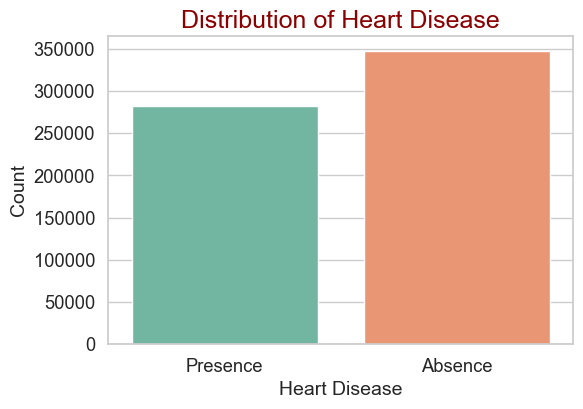

# Heart Disease Prediction — Advanced Machine Learning Pipeline

## Project Overview

This project builds an advanced machine learning pipeline to predict the presence of heart disease using clinical features.
Multiple models were trained and compared, followed by ensemble stacking to maximize predictive performance.

The final model achieved a **ROC-AUC score of ~0.955**, placing competitively on the leaderboard.

---

## Dataset

The dataset contains clinical patient attributes used to predict heart disease presence.

Features include physiological and diagnostic indicators.

Dataset source: Kaggle

Download dataset from Kaggle before running the notebook.

---

## Project Structure

```
heart-disease-ml
│
├── notebook
│   └── heart_disease_prediction.ipynb
│
├── images
│   ├── target_distribution.png
│   ├── feature_importance.png
│   ├── roc_curve_models.png
│   ├── confusion_matrix.png
│   └── shap_summary.png
│
├── requirements.txt
├── README.md
└── .gitignore
```

---

## Exploratory Data Analysis

The dataset was analyzed to understand class distribution and feature behavior.

### Target Distribution



---

## Feature Importance

A Random Forest model was used to estimate the most influential features.


---

## Models Implemented

The following models were trained and evaluated:

* Logistic Regression
* Random Forest
* Gradient Boosting
* XGBoost
* LightGBM

Evaluation metric: **ROC-AUC**

---

## Model Comparison

ROC curves were used to compare model performance.


---

## Ensemble Learning

To improve performance, a **stacked ensemble model** was built using:

Base models:

* Random Forest
* Gradient Boosting
* XGBoost
* LightGBM

Meta-model:

* Logistic Regression

This ensemble achieved the highest validation performance.

---

## Model Evaluation

Confusion matrix for the final stacked model:


---

## Model Explainability

SHAP (SHapley Additive exPlanations) was used to interpret model predictions and feature impact.


---

## Final Performance

Validation Metrics:

ROC-AUC: **0.9551**

Log Loss: **0.2786**

The ensemble model significantly outperformed baseline models.

---

## Installation

Clone repository:

```
git clone https://github.com/yourusername/heart-disease-ml.git
cd heart-disease-ml
```

Install dependencies:

```
pip install -r requirements.txt
```

---

## Running the Project

1. Download dataset from Kaggle
2. Place `train.csv` and `test.csv` in project root
3. Open the notebook

```
notebook/heart_disease_prediction.ipynb
```

Run all cells to reproduce results and generate predictions.

---

## Technologies Used

Python ecosystem:

* pandas
* numpy
* scikit-learn
* XGBoost
* LightGBM
* SHAP
* matplotlib
* seaborn
* plotly

---

## Author

Omar Jebbari

Engineering Student — Big Data & AI
